# Reto tecnico - SofkaU

## Objetivos del Proyecto

- Contruir una app tipo inventario de naves espaciales

## Tecnologias utilizadas

Frontend

- React - Redux
- Html
- Css

Backend

- Node Js
- Express
- Sequealize
- PostgreSql

## Pasos para usar el proyecto

Como principal debemos tener instalado nodeJs en nuestro equipo y postgresSQL

-Cuando tengamos descargado estas aplicaciones en la carpeta de api/db.js, debemos cambiar , el DB_USER por el usuario de postgres , y DB_PASSWORD con nuestra contraseña de postgres, igualmente debemos crear una base de datos llamada reto

  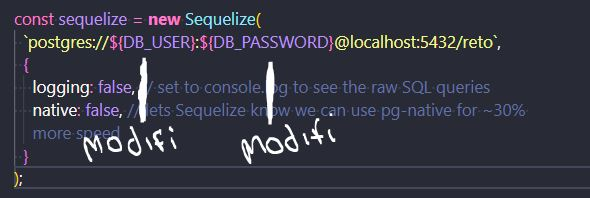

-Una vez completado estos paso , abrimos la carpeta api en una terminar y simplemente agregamos npm install , una vez terminado la instalacion procedemos a abrir el backend con el comando npm start

  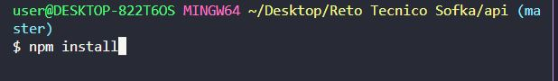

  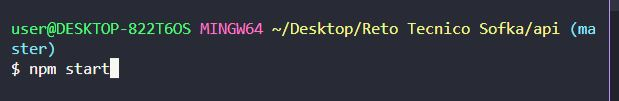

-Despues hacemos los mismos pasos en la carpeta Client , la abrimos en una terminal y ejecutamos el comando npm install , luego de la instalacion , copiamos el comando npm start y automaticamente se va abrir las pestañas del proyecto

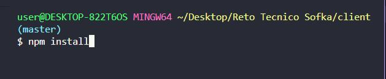

  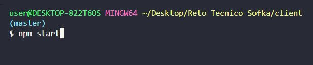

Despues de haber completado estos pasos podemos usar la aplicacion.

## Imagenes del reto

## Landing Page

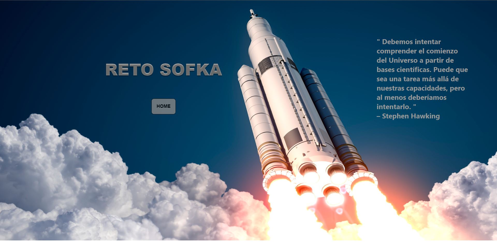

## Home

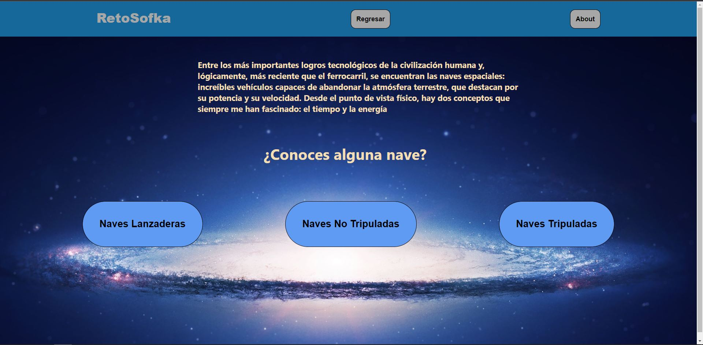

## About

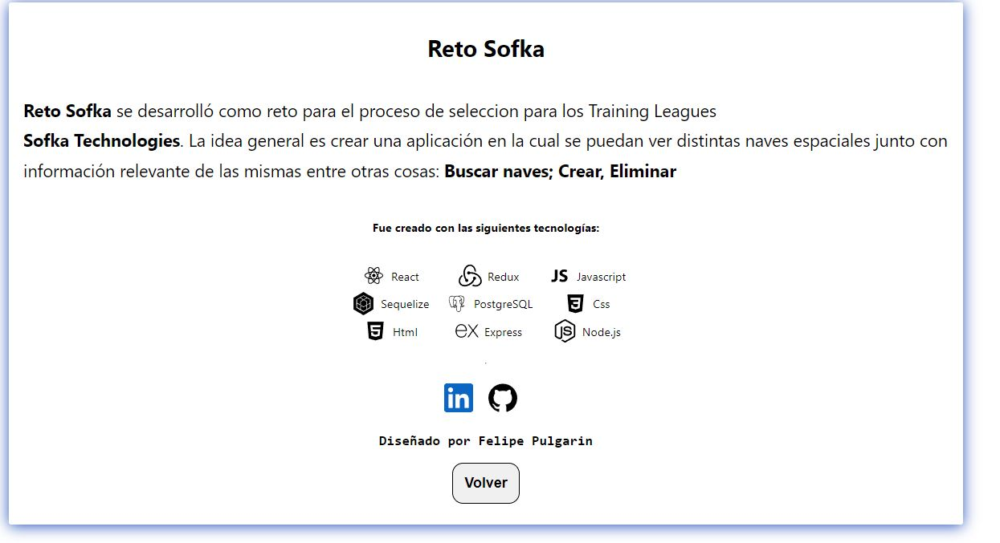

## Lanzadera

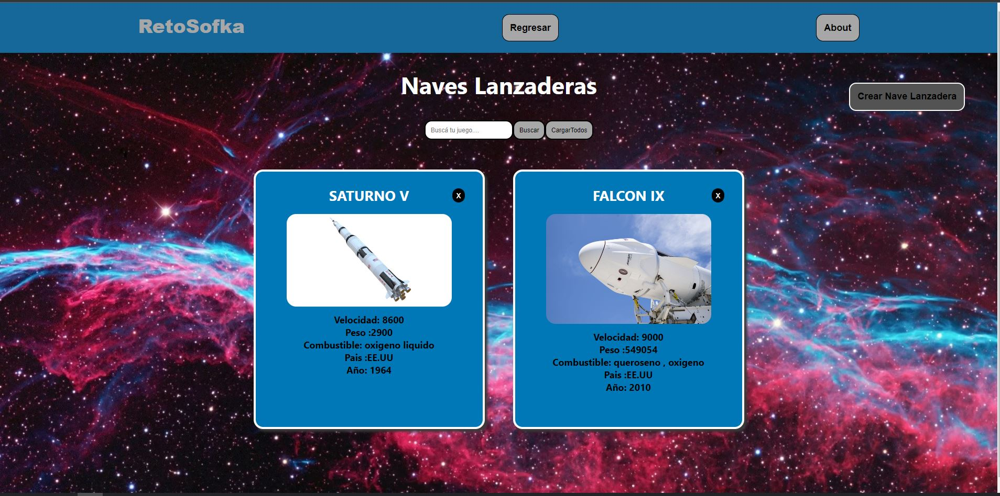

## No Tripuladas

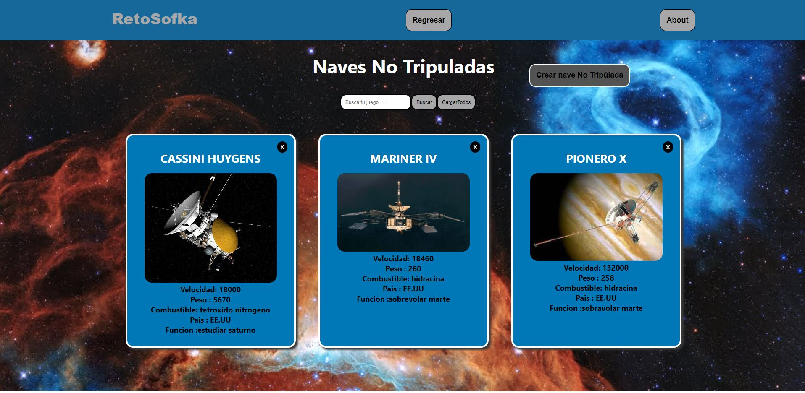

## Tripuladas

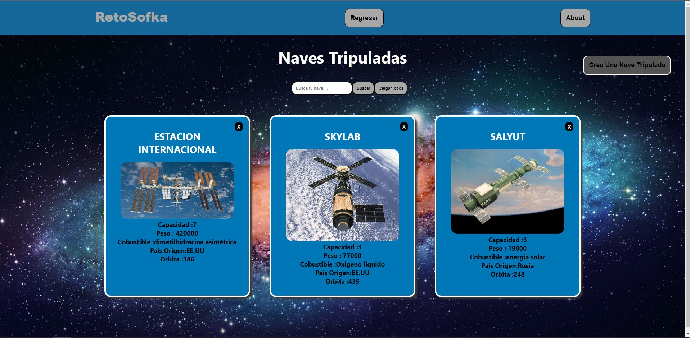

## Formulario

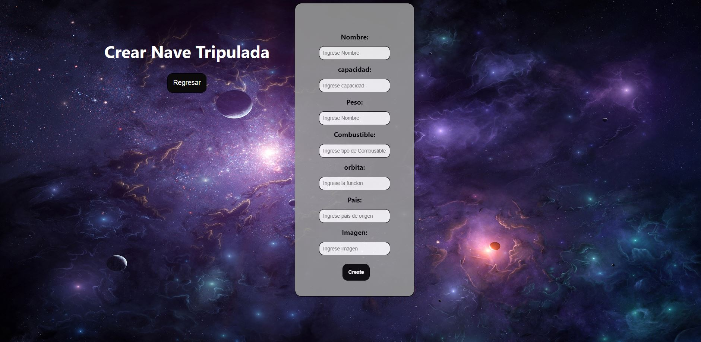
